# Windows Server 2025 Active Directory Domain Services Deployment

A hands-on Windows Server 2025 infrastructure lab documenting the deployment, configuration, and verification of a new Active Directory Domain Services (AD DS) environment.

The goal was not just to complete the installation wizard, but to verify that the domain controller, DNS configuration, domain shares, name resolution, and service discovery were working as expected in an isolated lab.

## Project Overview

| Item | Configuration |
|---|---|
| Operating system | Windows Server 2025 |
| Server | `WIN2K25-DC03` |
| Active Directory domain | `mypersonal.lan` |
| IPv4 address | `172.16.131.21/24` |
| Default gateway | `172.16.131.2` |
| DNS server | `172.16.131.21` |
| Server roles | Active Directory Domain Services, DNS Server |

## What I Implemented

- Configured a stable hostname and static IPv4 settings.
- Installed Active Directory Domain Services (AD DS).
- Created a new Active Directory forest for `mypersonal.lan`.
- Promoted `WIN2K25-DC03` to the first domain controller in the forest.
- Configured DNS Server and Global Catalog options.
- Verified the final post-promotion network and DNS configuration.
- Confirmed access through Active Directory Administrative Center.
- Created an Active Directory-integrated reverse lookup zone.
- Created and verified a PTR record.
- Verified `NETLOGON` and `SYSVOL` share availability.
- Tested forward and reverse DNS resolution with `nslookup`.
- Queried the LDAP SRV record used for domain-controller discovery.
- Used `dcdiag` as an additional domain-controller health check.

## Verification Highlights

### Static networking and DNS

The domain controller used a static address and its own DNS service so its network identity and DNS registration remained predictable.

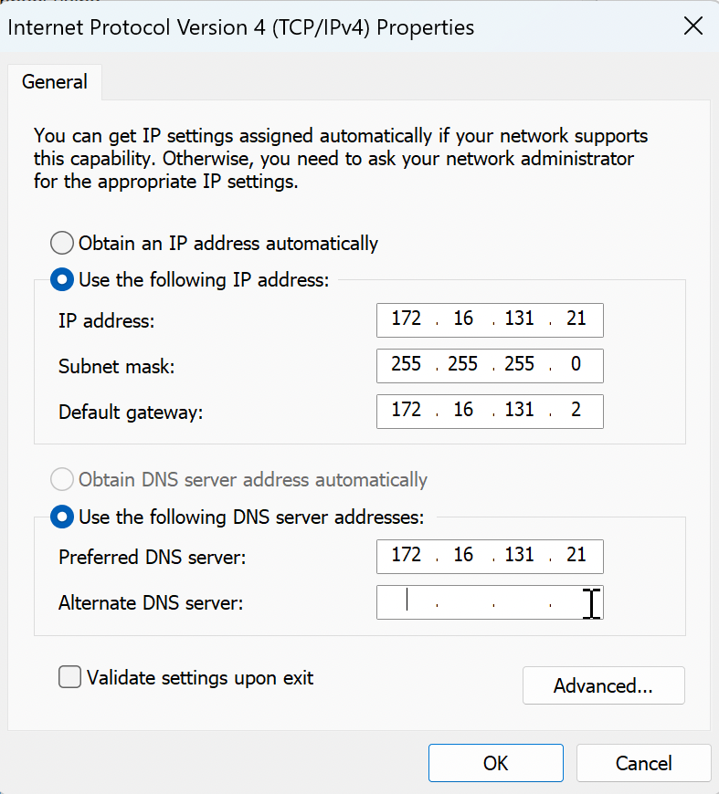

### AD DS role installation

Active Directory Domain Services was selected and installed before the server was promoted to a domain controller.

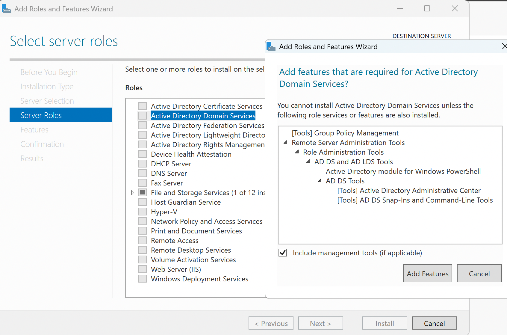

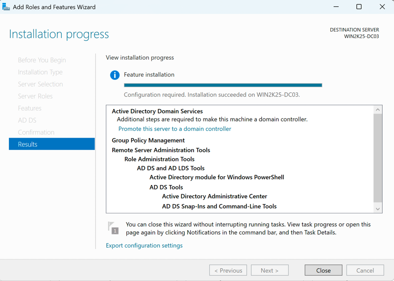

### New Active Directory forest

A new forest was created with `mypersonal.lan` as the root domain.

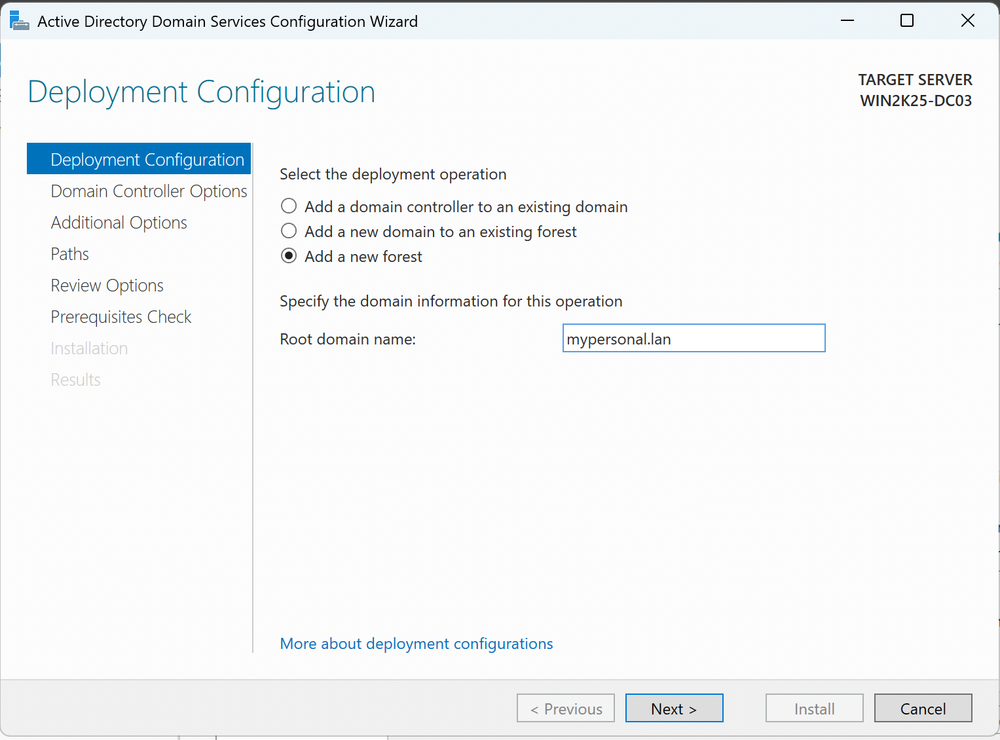

### Domain-controller options

The server was configured as a DNS server and Global Catalog, and a Directory Services Restore Mode (DSRM) password was set for recovery use.

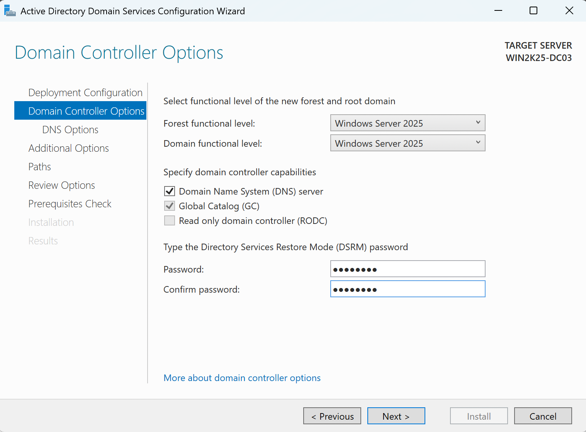

### Domain-controller promotion

After prerequisite checks completed, the server was promoted to the first domain controller for the new forest.

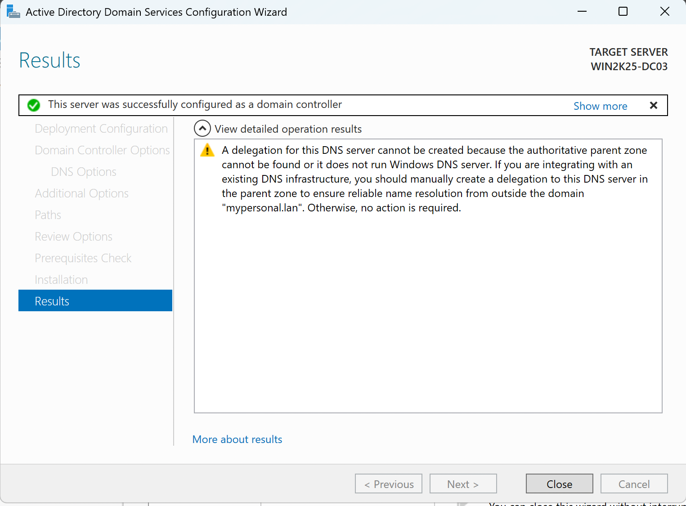

### Post-promotion verification

The final network state was verified after promotion, including the hostname, domain suffix, IPv4 address, gateway, and DNS server.

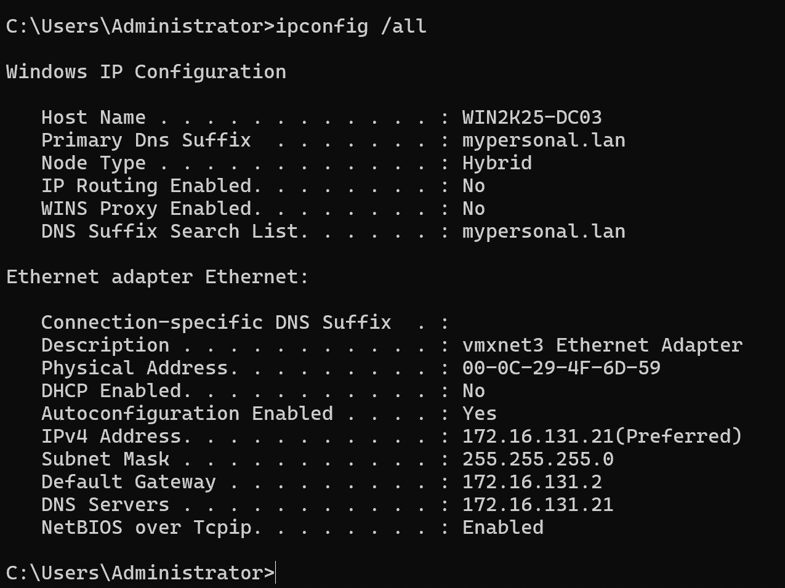

### Active Directory management access

Active Directory Administrative Center displayed the new `mypersonal.lan` domain and its standard containers.

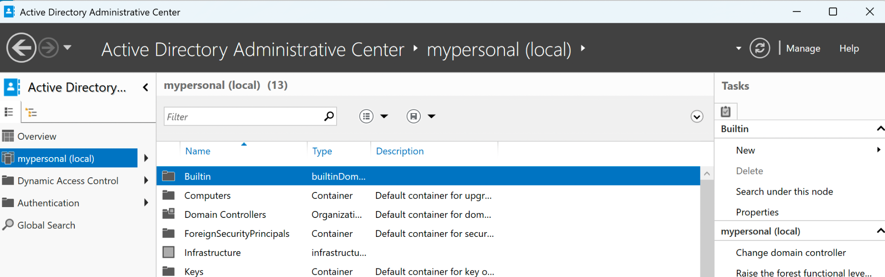

### Reverse DNS and PTR record

A reverse lookup zone was created for the `172.16.131.0/24` network, and the PTR record mapped the server address back to its fully qualified hostname.

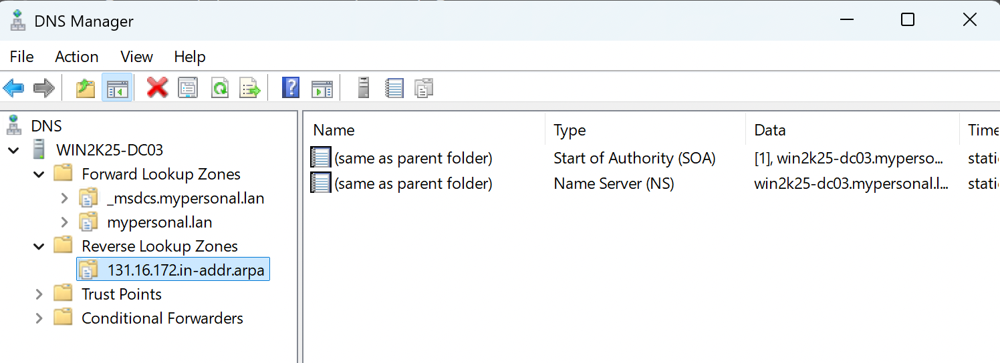

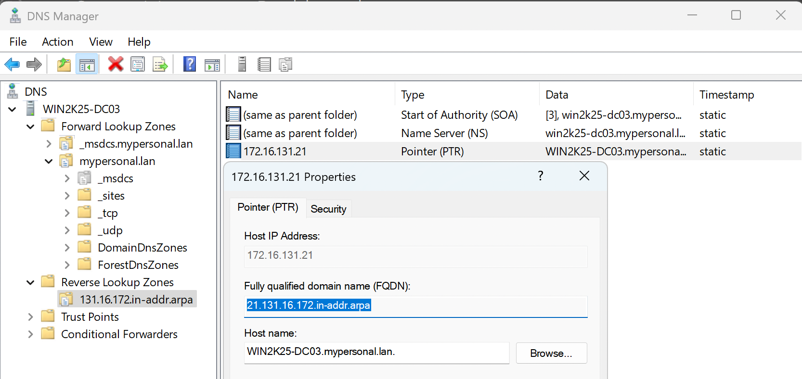

### NETLOGON and SYSVOL

The `net share` command confirmed that the expected `NETLOGON` and `SYSVOL` shares were available.

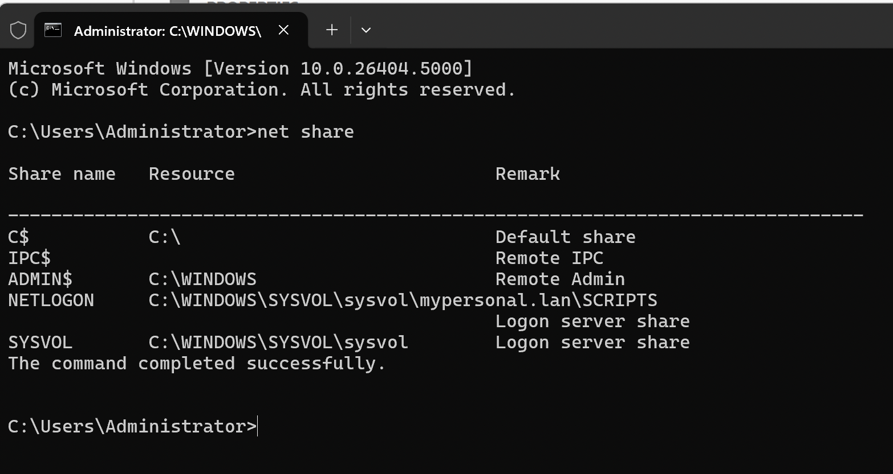

### Forward and reverse name resolution

Forward lookup:

```text
WIN2K25-DC03.mypersonal.lan -> 172.16.131.21
```

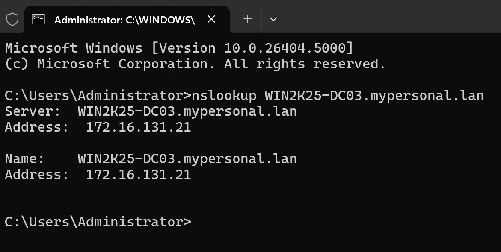

Reverse lookup:

```text
172.16.131.21 -> WIN2K25-DC03.mypersonal.lan
```

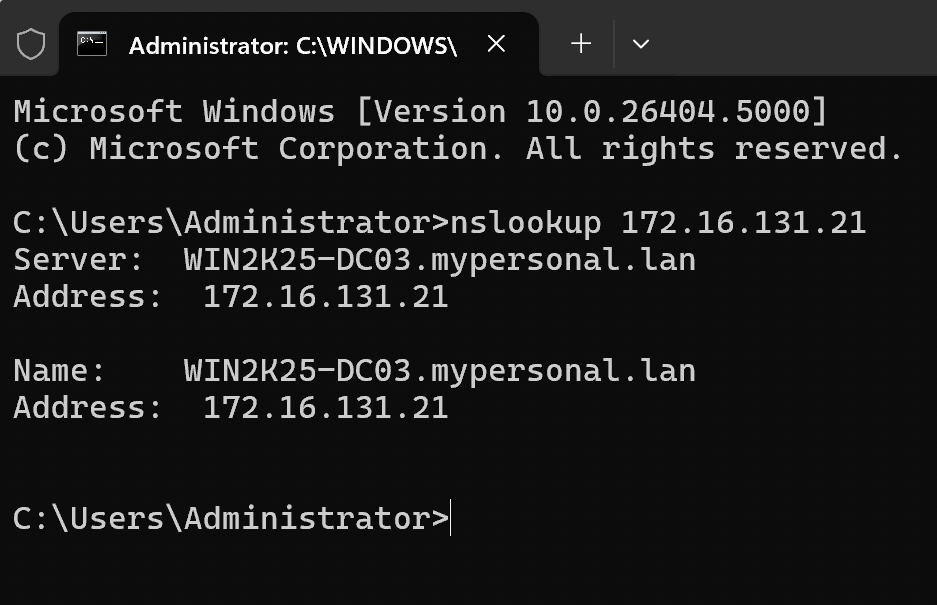

### Domain-controller discovery

The LDAP SRV query identified `WIN2K25-DC03.mypersonal.lan` on TCP port `389`, showing how DNS service records help domain members locate a domain controller.

```text
nslookup -type=SRV _ldap._tcp.dc._msdcs.mypersonal.lan
```

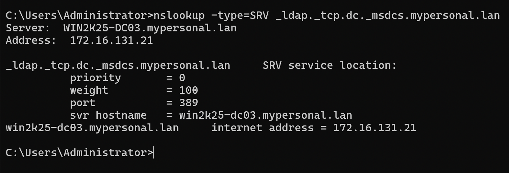

## Key Takeaways

- Active Directory depends heavily on DNS for domain-controller and service discovery.
- A stable hostname and static IP address provide a predictable foundation before promotion.
- Forward and reverse DNS answer different troubleshooting questions.
- The DSRM password is a recovery credential and is separate from normal domain Administrator sign-in.
- Installation success alone is not enough; verification through management tools, DNS queries, share checks, and diagnostics provides stronger evidence that the environment is functioning.

## Production Considerations

This project was built in a controlled lab environment. A production Active Directory design would require additional planning for areas such as:

- Multiple domain controllers and redundancy
- Backup and recovery
- Patch management
- Time synchronization
- DNS forwarders
- Monitoring and alerting
- Least-privilege administration
- Security baselines
- Disaster recovery

## Documentation

- [Concise portfolio report](docs/Windows_Server_2025_AD_DS_Deployment_Report.pdf)
- [Full technical walkthrough on MeetTech Notes](https://meet-tech.hashnode.dev/deploying-windows-server-2025-active-directory-domain-services-from-scratch)

The long-form article is hosted on MeetTech Notes rather than duplicated in this repository. This repository keeps the recruiter-friendly overview, the concise project report, and the supporting evidence screenshots together in one place.

## Repository Structure

```text
windows-server-2025-ad-ds-deployment/
├── README.md
├── .gitignore
├── assets/
│   └── article-cover.png
├── docs/
│   └── Windows_Server_2025_AD_DS_Portfolio_Report.pdf
└── screenshots/
    ├── 01-static-ip-dns.png
    ├── 02-ad-ds-role-selected.png
    ├── 03-ad-ds-installation-complete.png
    ├── 04-new-forest.png
    ├── 05-domain-controller-options.png
    ├── 06-promotion-complete.png
    ├── 07-post-promotion-network.png
    ├── 08-administrative-center.png
    ├── 09-reverse-lookup-zone.png
    ├── 10-ptr-record.png
    ├── 11-netlogon-sysvol.png
    ├── 12-forward-dns-lookup.png
    ├── 13-reverse-dns-lookup.png
    └── 14-ldap-srv-record.png
```

## Related Links

- **MeetTech Notes:** https://meet-tech.hashnode.dev/
- **Portfolio:** https://meetcybersec.lovable.app/
- **GitHub profile:** https://github.com/Meetyp

---

**Note:** This repository documents an isolated educational lab. It is not presented as a production deployment guide or production security architecture.
